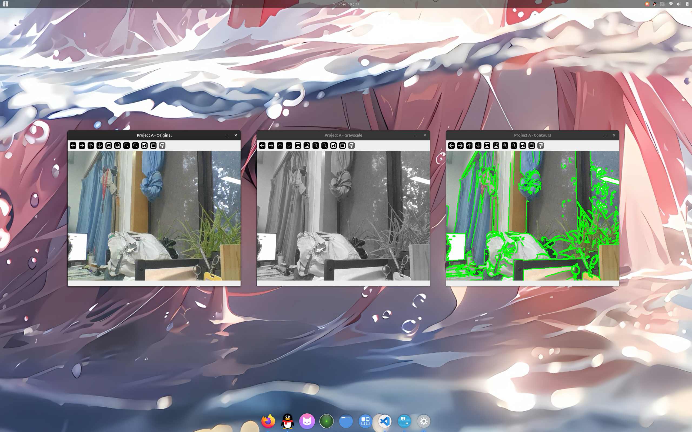
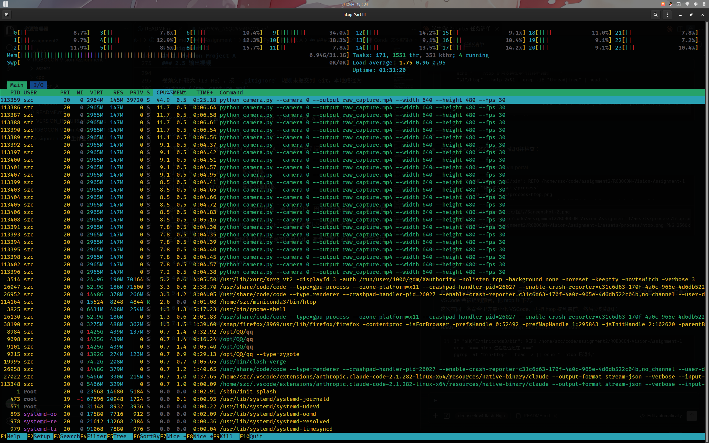

# Assignment 1

## 1. System Information

### 1.1 操作系统与内核

```bash
cat /etc/os-release
uname -r
```

```text
PRETTY_NAME="Ubuntu 24.04.5 LTS"
NAME="Ubuntu"
VERSION_ID="24.04"
VERSION="24.04.5 LTS (Noble Numbat)"
VERSION_CODENAME=noble
ID=ubuntu
ID_LIKE=debian
```

```text
7.0.0-34-generic
```

- Ubuntu 版本：**24.04.5 LTS (Noble Numbat)**
- Kernel 版本：**7.0.0-34-generic**

### 1.2 CPU

```bash
lscpu
```

关键字段：

```text
架构：                  x86_64
CPU:                    24
在线 CPU 列表：         0-23
厂商 ID：               GenuineIntel
型号名称：              Intel(R) Core(TM) i7-14650HX
CPU 最大 MHz：          5200.0000
CPU 最小 MHz：          800.0000
每个核的线程数：        2
每个座的核数：          16
座：                    1
L3 缓存：               30 MiB (1 instance)
NUMA 节点：             1
虚拟化：                VT-x
```

- CPU：**Intel(R) Core(TM) i7-14650HX**
- 拓扑：1 socket × 16 core × 2 thread = **24 逻辑处理器**
- 频率范围：800 MHz – 5200 MHz

### 1.3 GPU 与内核驱动

```bash
lspci | grep -Ei 'vga|3d|display'
```

```text
00:02.0 VGA compatible controller: Intel Corporation Raptor Lake-S UHD Graphics (rev 04)
02:00.0 VGA compatible controller: NVIDIA Corporation Device 2f18 (rev a1)
```

```bash
lspci -k | grep -EA3 'VGA|3D|Display'
```

```text
00:02.0 VGA compatible controller: Intel Corporation Raptor Lake-S UHD Graphics (rev 04)
	DeviceName: Onboard - Video
	Subsystem: Tongfang Hongkong Limited Raptor Lake-S UHD Graphics
	Kernel driver in use: i915
--
02:00.0 VGA compatible controller: NVIDIA Corporation Device 2f18 (rev a1)
	Subsystem: Tongfang Hongkong Limited Device 604e
	Kernel driver in use: nvidia
	Kernel modules: nvidiafb, nouveau, nvidia_drm, nvidia
```

本机为**双显卡（混合显卡）**环境：

| GPU | 设备 | 正在使用的内核驱动 |
|---|---|---|
| 集显 | Intel Raptor Lake-S UHD Graphics | `i915` |
| 独显 | NVIDIA GeForce RTX 5070 Ti Laptop GPU | `nvidia` |

注意 `Kernel modules` 一行列出 `nvidiafb, nouveau, nvidia_drm, nvidia` 表示内核中**存在**这些模块，
而 `Kernel driver in use: nvidia` 表示当前**实际生效**的是 NVIDIA 专有驱动，不是开源的 `nouveau`。

### 1.4 图形会话类型

```bash
echo "$XDG_SESSION_TYPE"
echo "$DISPLAY"
echo "$WAYLAND_DISPLAY"
```

```text
XDG_SESSION_TYPE=x11
DISPLAY=:1
WAYLAND_DISPLAY=
```

- 图形会话类型：**X11**（`XDG_SESSION_TYPE=x11`）
- `WAYLAND_DISPLAY` 为空，进一步确认当前不是 Wayland 会话

这一项对 Project A 有实际影响：OpenCV 的 `cv2.imshow` 依赖图形会话才能弹出窗口，
X11 下通过 `DISPLAY=:1` 正常显示。

### 1.5 NVIDIA Driver 与 CUDA Toolkit

```bash
nvidia-smi
```

```text
+-----------------------------------------------------------------------------------------+
| NVIDIA-SMI 595.91.07              Driver Version: 595.91.07      CUDA Version: 13.2     |
+-----------------------------------------+------------------------+----------------------+
| GPU  Name                 Persistence-M | Bus-Id          Disp.A | Volatile Uncorr. ECC |
| Fan  Temp   Perf          Pwr:Usage/Cap |           Memory-Usage | GPU-Util  Compute M. |
|=========================================+========================+======================|
|   0  NVIDIA GeForce RTX 5070 ...    Off |   00000000:02:00.0 Off |                  N/A |
| N/A   41C    P4             13W /   65W |      15MiB /  12227MiB |     24%      Default |
+-----------------------------------------+------------------------+----------------------+
```

```bash
nvcc --version
```

```text
/bin/bash: 行 76: nvcc: 未找到命令
```

- NVIDIA Driver：**595.91.07**
- CUDA Toolkit：**N/A（未安装）**

**必须区分的两点：**

| 项目 | 值 | 含义 |
|---|---|---|
| NVIDIA Driver 支持的 CUDA 能力 | 13.2 | `nvidia-smi` 右上角显示的 `CUDA Version`，指这个驱动**最高能支持**的 CUDA 运行时版本，是驱动的能力上限 |
| 实际安装的 CUDA Toolkit | 无 | `nvcc` 命令不存在，说明本机**没有安装** CUDA Toolkit |

`nvidia-smi` 里的 `CUDA Version: 13.2` **不能**等价为"本机已经安装了 CUDA 13.2 的 Toolkit"。
前者是驱动自带的能力声明，后者需要实际安装 `cuda-toolkit` 并具备 `nvcc` 编译器；
本机只满足前者。

对本 Assignment 而言，C++ 部分只需要 OpenCV 与 Eigen 的 CPU 版本，
**不依赖 CUDA Toolkit**，因此这一项缺失不影响后续任务。

### 1.6 汇总

```text
Ubuntu 版本:            24.04.5 LTS (Noble Numbat)
Kernel 版本:            7.0.0-34-generic
CPU:                    Intel(R) Core(TM) i7-14650HX, 16 核 / 24 线程
GPU:                    Intel Raptor Lake-S UHD Graphics (集显)
                        NVIDIA GeForce RTX 5070 Ti Laptop GPU (独显)
GPU 正在使用的内核驱动:   i915 (Intel) / nvidia (NVIDIA)
图形会话类型:            X11  (DISPLAY=:1, WAYLAND_DISPLAY 为空)
NVIDIA Driver:          595.91.07
CUDA Toolkit:           N/A (未安装, nvcc 不存在)
内存:                   31 GiB
架构:                   x86_64
```

## 2. Python Project A

### 2.1 准备工作：安装 Conda

```bash
curl -fL -o /tmp/miniconda.sh \
  https://mirrors.tuna.tsinghua.edu.cn/anaconda/miniconda/Miniconda3-latest-Linux-x86_64.sh
bash /tmp/miniconda.sh -b -p "$HOME/miniconda3"
"$HOME/miniconda3/bin/conda" init bash
```

```text
conda 26.7.1
```

镜像配置（加速下载，非作业要求）：

```yaml
# ~/.condarc
channels:
  - conda-forge
channel_alias: https://mirrors.tuna.tsinghua.edu.cn/anaconda/cloud
default_channels: []
show_channel_urls: true
channel_priority: flexible
```

```ini
# ~/.config/pip/pip.conf
[global]
index-url = https://mirrors.tuna.tsinghua.edu.cn/pypi/web/simple
trusted-host = mirrors.tuna.tsinghua.edu.cn
timeout = 60
```

### 2.2 创建环境

Project A 的 `pyproject.toml` 要求 `requires-python = ">=3.9,<3.11"`，
而本机系统 Python 是 3.12.3，无法满足，因此必须使用 Conda 环境：

```bash
conda create -n robocon_a python=3.10 -y
conda activate robocon_a
python --version
which python
```

```text
Python 3.10.21
/home/szc/miniconda3/envs/robocon_a/bin/python
```

`which python` 指向 conda 环境目录而不是 `/usr/bin/python3`，说明环境已正确激活。

### 2.3 安装依赖

```bash
cd python_A
pip install -r requirements.txt
```

```text
Successfully installed numpy-1.26.4 opencv-python-4.11.0.86
```

版本核对（对照 `VERSION_REQUIREMENTS.md`）：

| 依赖 | 实装版本 | 要求 | |
|---|---|---|---|
| Python | 3.10.21 | `>=3.9,<3.11` | ✅ |
| NumPy | 1.26.4 | `>=1.26,<2.0` | ✅ |
| OpenCV Python | 4.11.0.86 | `>=4.9,<5.0` | ✅ |

### 2.4 运行

```bash
python camera.py --camera 0 --output raw_capture.mp4 --width 640 --height 480 --fps 30
```

程序连续运行约 33 秒后，在 OpenCV 窗口中按 `q` 退出。程序完整输出：

```text
================================================================
ROBOCON Vision Assignment 1 - Python Project A
PID:          86141
PPID:         86133
Python:       /home/szc/miniconda3/envs/robocon_a/bin/python
Python ver.:  3.10.21
Camera index: 0
Raw output:   /home/szc/code/assignment2/ROBOCON-Vision-Assignment-1/python_A/raw_capture.mp4
Keep this process running and inspect it from another terminal.
Press q or ESC in an OpenCV window to exit.
================================================================
Actual stream: 640x480, writer FPS=30.00
Saved raw video: /home/szc/code/assignment2/ROBOCON-Vision-Assignment-1/python_A/raw_capture.mp4
Captured frames: 1000
Elapsed time:    33.3 s
Loop rate:       30.0 frame/s
```

程序启动时打印的 `PID` 与 `PPID` 供第 3 节 Process Observation 核对使用。

### 2.5 输出视频

```text
raw_capture.mp4: 1000 帧, 30.00 fps, 640x480, 时长 33.3 s
```

运行时长 33.3 秒，满足"连续运行至少 30 秒"的要求。

验证该视频确实是**未经处理的原始画面**（而非灰度或轮廓结果）：抽查第 0、500、999 帧的
B/G/R 三通道均值，三通道存在明显差异，说明是彩色帧：

```text
帧   0 可读=True B/G/R=92.4/104.8/104.1 彩差=12.4
帧 500 可读=True B/G/R=117.5/125.6/121.3 彩差=8.1
帧 999 可读=True B/G/R=119.9/127.5/123.0 彩差=7.7
```

若保存的是灰度图或轮廓图，三通道均值会几乎相等（彩差接近 0）。
源码中 `writer.write(frame)` 位于 `process_frame()` 之前，也保证了写入的是原始帧。

视频文件较大（13 MB），按 `.gitignore` 规则未提交到 Git，本地路径为
`python_A/raw_capture.mp4`。

### 2.6 图像结果截图



`assets/python_a/project_a_windows.png`

三个窗口来自**同一次运行**的 Project A，从左到右分别是：

```text
Project A - Original    原始图像
Project A - Grayscale   灰度图像
Project A - Contours    轮廓处理图像
```

截图说明：OpenCV 窗口默认以层叠方式出现，会互相遮挡，因此运行期间把三个窗口横向平铺
（窗口本身不支持缩放，`WINDOW_AUTOSIZE` 设定了固定尺寸提示，故用 `--width 640 --height 480`
让三个窗口能够并排放下）。截图时将其它无关窗口最小化，避免桌面上的其他内容干扰证据。

## 3. Process Observation

Project A 启动时会打印自己的 PID 与 PPID：

```text
PID:          113359
PPID:         113351
```

下面另开终端，**自己从系统里找出这个进程**再与上面的数字核对。

### 3.1 查找过程

按名字查找：

```bash
pgrep -af "camera.py"
```

```text
113359 python camera.py --camera 0 --output raw_capture.mp4 --width 640 --height 480 --fps 30
```

（`pgrep -af` 会把启动它的那个 shell 一并匹配进来，上面只保留程序本身那一行。）

`ps` 配合管道过滤，这种方式还能同时看到 PPID：

```bash
ps -ef | grep "camera.py" | grep -v grep
```

```text
szc   113359  113351  99 18:33 ?  00:00:34 python camera.py --camera 0 --output raw_capture.mp4 --width 640 --height 480 --fps 30
```

还可以反过来按 CPU 占用排序，"谁在吃 CPU" 一眼就能看出来：

```bash
ps aux --sort=-%cpu | head -6
```

```text
PID      %CPU   %MEM   STAT   TIME      COMMAND
113359   247    0.4    Sl     0:34      python camera.py --camera 0 --output raw_capture.mp4 --width
26952    15.4   0.9    Sl     11:51     /usr/share/code/code --type=renderer ...
26047    6.6    0.5    Sl     5:06      /usr/share/code/code --type=gpu-process ...
26069    6.0    1.2    Sl     4:38      /usr/share/code/code --type=renderer ...
3825     5.8    1.2    Ssl    5:15      /usr/bin/gnome-shell
```

### 3.2 与程序打印的 PID 核对

程序自己打印的是 `113359`，而系统里查到的 `camera.py` 进程号同样是 `113359`：

```bash
ps -p 113359 -o pid=,cmd=
```

```text
113359 python camera.py --camera 0 --output raw_capture.mp4 --width 640 --height 480 --fps 30
```

两者一致，说明找到的就是 Project A 本身，而不是别的 Python 进程。

### 3.3 观测指标

```bash
ps -o pid,ppid,%cpu,%mem,etime,nlwp,cmd -p 113359
```

```text
    PID    PPID %CPU %MEM     ELAPSED NLWP CMD
 113359  113351  247  0.4       00:14   48 python camera.py --camera 0 --output raw_capture.mp4 --width 640 --height 480 --fps 30
```

| 项目 | 值 |
|---|---|
| PID | 113359 |
| PPID | 113351 |
| CMD | `python camera.py --camera 0 --output raw_capture.mp4 --width 640 --height 480 --fps 30` |
| CPU % | 247（`ps` 的生命周期均值）／ 227.3（`top` 瞬时） |
| MEM % | 0.4 |
| 运行时间 | 00:14（该次采样时刻） |
| 线程数 | 48（`NLWP`） |

**关于 CPU % 超过 100**：这不是异常。`ps`/`top` 的 `%CPU` 是**按单个核心为 100%** 计算的，
进程内部有 48 个线程并行跑（`NLWP` 一列），所以多核累加后超过 100% 属正常现象。

`top` 单独取一次瞬时值：

```bash
top -b -n 1 -p 113359
```

```text
 进程号 USER      PR  NI    虚拟   驻留   共享    %CPU  %MEM     时间+ COMMAND
 113359 szc       20   0 3036060 149780 109420 R 227.3   0.5   0:35.43 python
```

### 3.4 进程树与线程

```bash
pstree -p 113359
```

```text
python(113359)-+-{python}(113362)
               |-{python}(113363)
               |-{python}(113364)
               ...
```

`pstree` 里 `{python}` 是线程（花括号表示线程，圆括号表示进程），
逐个列出该进程的 48 个线程。也可以直接用 `ps` 的 `-L` 选项看：

```bash
ps -o pid,tid,comm -L -p 113359 | head -5
```

```text
    PID     TID COMMAND
 113359  113359 python
 113359  113362 python
 113359  113363 python
 113359  113364 python
```

`PID` 一列全是 113359（同一个进程），`TID` 各不相同，说明确实是多线程。

**PPID 会变化**：程序刚启动时 PPID 是 `113351`（启动它的那个 shell）；
程序运行一段时间后再采样，PPID 变成了 `3390`（`systemd`）：

```bash
ps -o pid,ppid,%cpu,%mem,etime,nlwp,cmd -p 113359
```

```text
    PID    PPID %CPU %MEM     ELAPSED NLWP CMD
 113359    3390  200  0.4       01:26   48 python camera.py --camera 0 --output raw_capture.mp4 --width 640 --height 480 --fps 30
```

原因是**原来那个父进程（shell）已经退出了**，`camera.py` 成为孤儿进程后被 init/systemd 收养
（reparent）。这是一个正常的内核行为，不是程序的问题。

### 3.5 htop 截图



`assets/process/htop.png`

截图内容说明：

```text
顶部 24 条 CPU 占用条            当前电脑各核心使用情况
Mem: 6.94G/31.1G                内存占用
Tasks: 171; 1551 thr; 351 kthr  任务数 / 线程数
Load average: 1.75 0.96 0.95    系统负载
进程列表                          python camera.py 及其各线程
```

htop 中按 `H` 开启了线程视图，因此 `python camera.py` 的 48 个线程会各自作为一行列出，
可以看到主线程与各子线程分别占用的 CPU。

截图时把三个 OpenCV 窗口以及其它无关窗口最小化，避免遮挡 htop。

## 4. Python Project B

Project B 读取 Project A 保存的原始视频，离线处理后再输出一个 MP4，
输出画面为三个并排面板：

```text
原始视频 | Canny 边缘 | 帧间运动区域
```

### 4.1 创建第二个环境

Project B 的 `pyproject.toml` 要求 `requires-python = ">=3.12,<3.14"`：

```bash
conda create -n robocon_b python=3.12 -y
conda activate robocon_b
python --version
which python
```

```text
Python 3.12.14
/home/szc/miniconda3/envs/robocon_b/bin/python
```

### 4.2 安装依赖

```bash
cd python_B
pip install -r requirements.txt
```

```text
Successfully installed imageio-2.37.4 imageio-ffmpeg-0.6.0 lazy-loader-0.6
networkx-3.7 numpy-2.5.3 pillow-12.3.0 scikit-image-0.26.0 scipy-1.18.1 tifffile-2026.9.20
```

版本核对：

| 依赖 | 实装版本 | 要求 | |
|---|---|---|---|
| Python | 3.12.14 | `>=3.12,<3.14` | ✅ |
| NumPy | 2.5.3 | `>=2.0,<3.0` | ✅ |
| ImageIO | 2.37.4 | `>=2.36,<3.0` | ✅ |
| imageio-ffmpeg | 0.6.0 | `>=0.5,<1.0` | ✅ |
| scikit-image | 0.26.0 | `>=0.24,<0.27` | ✅ |

本项目**不依赖 OpenCV**，写出 H.264 由 `imageio-ffmpeg` 自带的 ffmpeg 完成：

```bash
python -c "import imageio_ffmpeg; print(imageio_ffmpeg.get_ffmpeg_exe())"
```

```text
/home/szc/miniconda3/envs/robocon_b/lib/python3.12/site-packages/imageio_ffmpeg/binaries/ffmpeg-linux-x86_64-v7.0.2
ffmpeg version 7.0.2-static
```

### 4.3 运行

```bash
python analyze_video.py \
  --input ../python_A/raw_capture.mp4 \
  --output advanced_analysis.mp4
```

```text
Processed 30 frames...
Processed 60 frames...
...
Processed 2670 frames...
Input:  /home/szc/code/assignment2/ROBOCON-Vision-Assignment-1/python_A/raw_capture.mp4
Output: /home/szc/code/assignment2/ROBOCON-Vision-Assignment-1/python_B/advanced_analysis.mp4
Frames: 2696
Panels: original | Canny edges | motion mask
```

### 4.4 输出结果

```text
advanced_analysis.mp4: 2696 帧, 30 fps, 1920x480, 时长 89.87 s, H.264, 106 MB
```

1920 = 640 × 3，正好是三个面板并排的宽度。输出视频体积较大（106 MB），
按 `.gitignore` 规则未提交到 Git，本地路径为 `python_B/advanced_analysis.mp4`。

画面证据（第 50 秒的一帧）：


`assets/python_b/advanced_analysis_frame.png`

```text
面板0  原始视频      平均色=121.0  标准差=50.9
面板1  Canny 边缘    平均色= 25.4  标准差=75.4   非黑像素 93528
面板2  帧间运动      平均色=  1.4  标准差=18.5   非黑像素  4917
```

**关于运动面板大面积是黑的**：这不是程序错误。本次拍摄时摄像头对着静止的场景，
相邻帧差异低于 `analyze_frame()` 里 `np.abs(gray - previous_gray) > 0.08` 的阈值，
所以大部分帧的运动掩膜为空。逐帧统计可验证：

```text
帧    0 ~ 1400    运动面板非黑像素 = 0
帧 1500           运动面板非黑像素 = 4917     <- 上面截图用的就是这一帧
帧 2300           运动面板非黑像素 = 249
帧 2500           运动面板非黑像素 = 1074
其余帧                                   = 0
```

只有画面中确实出现运动的那几帧检测到了变化，说明运动检测逻辑本身工作正常。

### 4.5 为什么不能用同一个环境

```text
Project A 使用的 Conda 环境: robocon_a
Python 版本:                 3.10.21
Project B 使用的 Conda 环境: robocon_b
Python 版本:                 3.12.14
```

原因是两个项目在元数据里声明了**互相排斥**的版本范围，无法同时满足：

| | Project A | Project B | 是否相容 |
|---|---|---|---|
| Python | `>=3.9,<3.11` | `>=3.12,<3.14` | ❌ 区间不相交 |
| NumPy | `>=1.26,<2.0` | `>=2.0,<3.0` | ❌ 区间不相交 |

Python 的要求是 `[3.9, 3.11)` 与 `[3.12, 3.14)`，**没有任何一个版本能同时落进两个区间**；
NumPy 的 `1.x` 与 `2.x` 同样没有交集。作业明确不允许修改 `pyproject.toml` 里的
`requires-python` 来绕过，所以唯一的做法就是建两个独立环境。

这也是为什么不能"先把 A 跑完再把环境升级成 B"——那样会破坏 A 的环境。
两个环境各自独立，互不影响，作业结束时两个项目都能重新运行。

做完 Project B 之后回查两个环境，确认互不干扰、都还能用：

```bash
~/miniconda3/envs/robocon_a/bin/python -c "import sys, numpy, cv2; print(sys.version.split()[0], numpy.__version__, cv2.__version__)"
~/miniconda3/envs/robocon_b/bin/python -c "import sys, numpy, skimage, imageio; print(sys.version.split()[0], numpy.__version__, skimage.__version__)"
```

```text
robocon_a:  3.10.21   numpy 1.26.4   cv2 4.11.0
robocon_b:  3.12.14   numpy 2.5.3    skimage 0.26.0   imageio 2.37.4
```

两个环境的 NumPy 主版本不同（1.26.4 / 2.5.3）却互不影响；
`robocon_a` 里没有 scikit-image、`robocon_b` 里没有 OpenCV，正是项目各自的依赖预期。

## 5. C++ Manual Build

本章**不使用 CMake**，先用一条完整的 `g++` 命令完成构建。

### 5.1 依赖准备

```bash
g++ --version
```

```text
g++ (Ubuntu 13.3.0-6ubuntu2~24.04.1) 13.3.0
```

OpenCV 与 Eigen 使用 Ubuntu 发行版的 development package，**不从源码编译**：

```bash
dpkg -l | grep -E "libopencv-dev|libeigen3-dev"
```

```text
ii  libeigen3-dev   3.4.0-4build0.1
ii  libopencv-dev   4.6.0+dfsg-13.1ubuntu1
```

```bash
pkg-config --modversion opencv4
```

```text
OpenCV C++: 4.6.0      (要求 >=4.5,<5.0  ✅)
Eigen:      3.4.0      (要求 >=3.3,<4.0  ✅)
```

注意 Python 环境里的 `opencv-python`（`robocon_a` 中的 4.11.0）**不能**用于 C++ 编译 ——
那只是给 Python 用的 wheel，不含 C++ 头文件和链接库。

头文件和库的实际位置：

```bash
pkg-config --variable=includedir opencv4     # /usr/include/opencv4
pkg-config --variable=libdir     opencv4     # /usr/lib/x86_64-linux-gnu
ls /usr/include/eigen3/Eigen/Dense           # Eigen 是纯头文件库
```

### 5.2 手工 g++ 命令

```bash
g++ -std=c++17 -Iinclude -I/usr/include/eigen3 \
    src/main.cpp src/transform.cpp \
    $(pkg-config --cflags --libs opencv4) \
    -o video_processor
```

`pkg-config` 提供的两组参数：

```bash
pkg-config --cflags opencv4
# -I/usr/include/opencv4

pkg-config --libs opencv4
# -lopencv_stitching -lopencv_alphamat ... -lopencv_imgproc -lopencv_core
```

编译结果：

```text
real    0m1.786s
```

```text
video_processor: ELF 64-bit LSB pie executable, x86-64, dynamically linked, not stripped
-rwxrwxr-x  67K  video_processor
```

没有产生 `.o` 中间文件（一条命令直接完成编译和链接）。

### 5.3 运行

```bash
./video_processor ../python_A/raw_capture.mp4
```

```text
Input: ../python_A/raw_capture.mp4
Output: cpp_processed.mp4
Frames: 2696
Mean scene luma: 121.097
Panels: original | Otsu binary | Canny edges
```

输出（省略第二个参数时默认写 `cpp_processed.mp4`）：

```text
cpp_processed.mp4: 2696 帧, 30 fps, 1920x480, 时长 89.87 s, 编码 mp4v, 208 MB
```

`Mean scene luma: 121.097` 是 `transform.cpp` 里用 **Eigen** 算出来的
（对画面平均 BGR 做点积），这个亮度值随后参与 Canny 的高低阈值计算：

```cpp
const Eigen::Vector3d bgr_to_luma(0.114, 0.587, 0.299);
const double luma = bgr_to_luma.dot(mean_color);
```

画面证据（第 50 秒的一帧）：


`assets/cpp/cpp_processed_frame.png`

```text
面板0  原始视频       平均=120.0  标准差= 50.9  非黑像素 307200
面板1  Otsu 二值化    平均=129.7  标准差=125.6
面板2  Canny 边缘     平均=  9.3  标准差= 47.1  非黑像素  11085
```

二值化面板的灰度直方图是**完全双峰**的，验证 Otsu 确实输出了二值结果：

```text
    0- 31   148817  48.44%   ##############################################
   32-223        0   0.00%
  224-255   158383  51.56%   ##################################################
```

视频文件较大（208 MB），按 `.gitignore` 规则未提交到 Git，本地路径为 `cpp/cpp_processed.mp4`。

### 5.4 作业要求回答的问题

**1. `-I` 的作用是什么？**

`-I` 告诉编译器**去哪里找 `#include` 的头文件**。默认只搜索系统目录和当前文件所在目录，
不会搜索 `include/`。本项目里 `main.cpp` 写了 `#include "transform.hpp"`，而这个文件在
`include/` 下，所以必须加 `-Iinclude`。同理 `transform.cpp` 写了 `#include <Eigen/Dense>`，
Eigen 装在 `/usr/include/eigen3`，所以必须加 `-I/usr/include/eigen3`。

实测不加的后果：

```bash
# 不加 -Iinclude
$ g++ -std=c++17 src/main.cpp src/transform.cpp $(pkg-config --cflags --libs opencv4) -o /tmp/_x1
src/main.cpp:7:10: fatal error: transform.hpp: 没有那个文件或目录
```

```bash
# 不加 -I/usr/include/eigen3
$ g++ -std=c++17 -Iinclude src/main.cpp src/transform.cpp $(pkg-config --cflags --libs opencv4) -o /tmp/_x2
src/transform.cpp:6:10: fatal error: Eigen/Dense: 没有那个文件或目录
```

**2. 为什么 `transform.hpp` 不单独作为一个 cpp 文件编译？**

因为它**不是编译单元**。`transform.hpp` 里只有**声明**：

```cpp
TransformResult transformFrame(const cv::Mat& bgr_frame);
cv::Mat composePreview(const cv::Mat& original, const TransformResult& result);
```

没有函数体，编译它产生不出任何机器码。它的作用是让 `main.cpp` 和 `transform.cpp`
都认识这两个函数的签名 —— `main.cpp` 据此知道自己可以调用它们，`transform.cpp` 据此
确认自己的实现和声明一致。`#pragma once` 保证同一个编译单元里重复包含时只展开一次。

真正需要参与编译的是两个 `.cpp`：`main.cpp`（含 `main`）和 `transform.cpp`（含函数实现）。

**3. 为什么只写 `main.cpp` 往往无法得到完整程序？**

因为 `main.cpp` 只**调用**了那两个函数，函数体在 `transform.cpp` 里。
只编译 `main.cpp` 能通过编译阶段（头文件提供了声明），但**链接阶段会失败**：

```bash
$ g++ -std=c++17 -Iinclude -I/usr/include/eigen3 src/main.cpp $(pkg-config --cflags --libs opencv4) -o /tmp/_x3
main.cpp:(.text+0x3a0): undefined reference to `transformFrame(cv::Mat const&)'
/usr/bin/ld: main.cpp:(.text+0x3c0): undefined reference to `composePreview(cv::Mat const&, TransformResult const&)'
collect2: error: ld returned 1 exit status
```

`undefined reference` 是链接器报的错，意思正是"有声明、没找到实现"。

顺带验证：不给 OpenCV 参数时，连编译阶段都过不去：

```bash
$ g++ -std=c++17 -Iinclude -I/usr/include/eigen3 src/main.cpp src/transform.cpp -o /tmp/_x4
src/main.cpp:5:10: fatal error: opencv2/opencv.hpp: 没有那个文件或目录
```

**4. 编译成功后产生的文件是什么？**

是一个**可执行文件**，本例中命名为 `video_processor`（由 `-o` 指定）。
`file` 的输出：

```text
video_processor: ELF 64-bit LSB pie executable, x86-64, version 1 (SYSV),
dynamically linked, interpreter /lib64/ld-linux-x86-64.so.2, for GNU/Linux 3.2.0, not stripped
```

它是动态链接的可执行文件，"dynamically linked" 说明 OpenCV 的库**没有**被复制进这个文件，
运行时才由动态链接器从 `/usr/lib/x86_64-linux-gnu` 加载。

如果**省略 `-o`**，g++ 会默认产出名为 `a.out` 的文件：

```bash
$ g++ -std=c++17 -Iinclude -I/usr/include/eigen3 src/main.cpp src/transform.cpp \
      $(pkg-config --cflags --libs opencv4)
$ ls -l a.out
-rwxrwxr-x 1 szc szc 67744  a.out
```

## 6. CMake Build

手工 `g++` 构建成功之后，才进入 CMake 阶段。仓库原本**没有** `CMakeLists.txt`，
这是作业设定的一部分，由学生自己编写。

### 6.1 CMakeLists.txt 的完整内容

文件位于 `cpp/CMakeLists.txt`：

```cmake
cmake_minimum_required(VERSION 3.16)

project(robocon_vision_cpp
    VERSION 1.0.0
    DESCRIPTION "ROBOCON Vision Assignment 1 - C++ video transform"
    LANGUAGES CXX
)

set(CMAKE_CXX_STANDARD 17)
set(CMAKE_CXX_STANDARD_REQUIRED ON)
set(CMAKE_CXX_EXTENSIONS OFF)

# 手工编译时 -Iinclude 和 -I/usr/include/eigen3 由命令行给出,
# CMake 中分别由 target_include_directories 和 Eigen3::Eigen 的
# INTERFACE_INCLUDE_DIRECTORIES 提供。
find_package(OpenCV REQUIRED)
find_package(Eigen3 REQUIRED)

add_executable(video_processor
    src/main.cpp
    src/transform.cpp
)

target_include_directories(video_processor
    PRIVATE
        ${CMAKE_CURRENT_SOURCE_DIR}/include
)

target_link_libraries(video_processor
    PRIVATE
        ${OpenCV_LIBS}
        Eigen3::Eigen
)
```

几个选择的原因：

- `add_executable` 里写**两个 `.cpp`** —— 对应手工命令里 `src/main.cpp src/transform.cpp`。
  仍然不包含 `transform.hpp`，因为头文件不是编译单元（见第 5.4 节第 2 问）。
- `target_include_directories(... include)` —— 对应手工的 `-Iinclude`。
- `Eigen3::Eigen` 是一个 imported target，它自带 `INTERFACE_INCLUDE_DIRECTORIES`，
  所以**不需要**手写 `-I/usr/include/eigen3`。
- `find_package(OpenCV REQUIRED)` 提供的 `${OpenCV_LIBS}` —— 对应手工的
  `pkg-config --libs opencv4`。
- `CMAKE_CXX_STANDARD 17` —— 对应手工的 `-std=c++17`。

### 6.2 configure 与 build

```bash
cmake -S . -B build
```

```text
-- The CXX compiler identification is GNU 13.3.0
-- Detecting CXX compiler ABI info - done
-- Check for working CXX compiler: /usr/bin/c++ - skipped
-- Detecting CXX compile features - done
-- Found OpenCV: /usr (found version "4.6.0")
-- Configuring done (0.3s)
-- Generating done (0.0s)
-- Build files have been written to: .../cpp/build
```

```bash
cmake --build build
```

```text
[ 33%] Building CXX object CMakeFiles/video_processor.dir/src/main.cpp.o
[ 66%] Building CXX object CMakeFiles/video_processor.dir/src/transform.cpp.o
[100%] Linking CXX executable video_processor
[100%] Built target video_processor
```

产物：

```text
-rwxrwxr-x  67K  build/video_processor
build/video_processor: ELF 64-bit LSB pie executable, x86-64, dynamically linked, not stripped
```

注意这里**产生了 `.o` 文件**（在 `build/CMakeFiles/` 下），而手工那条命令是一步到底、
不落 `.o`。CMake 默认走的是"编译成目标文件，再统一链接"的两步流程。

### 6.3 从 build/ 运行

```bash
cd build
./video_processor ../../python_A/raw_capture.mp4 cpp_from_cmake.mp4
```

```text
Input: ../../python_A/raw_capture.mp4
Output: cpp_from_cmake.mp4
Frames: 2696
Mean scene luma: 121.097
Panels: original | Otsu binary | Canny edges

real    0m10.388s
```

输出 `build/cpp_from_cmake.mp4`：2696 帧，30 fps，1920x480，mp4v，208 MB，
`Mean scene luma` 与手工编译的版本完全一致（121.097）。

### 6.4 手工 g++ 命令和 CMake 的关系是什么？

**CMake 不自己编译代码，它是"生成构建脚本的工具"。**
`cmake -S . -B build` 读 `CMakeLists.txt`，生成一组 Makefile；
`cmake --build build` 再去执行这些 Makefile —— 而 Makefile 里跑的还是**同一条 `g++` 命令**。
所以 CMake 做的是"把手写的编译命令自动化地拼出来"，不是另一套编译机制。

这一点可以直接验证。CMake 生成的编译命令：

```bash
cat build/CMakeFiles/video_processor.dir/flags.make
```

```text
CXX_INCLUDES = -I<项目>/cpp/include -isystem /usr/include/opencv4 -isystem /usr/include/eigen3
CXX_FLAGS    = -std=c++17
```

与手工命令逐段对应：

| 手工 g++ 命令里的部分 | CMake 里由谁提供 |
|---|---|
| `-std=c++17` | `set(CMAKE_CXX_STANDARD 17)` |
| `-Iinclude` | `target_include_directories(...)` |
| `-I/usr/include/eigen3` | `Eigen3::Eigen` 这个 imported target |
| `$(pkg-config --cflags opencv4)` 即 `-I/usr/include/opencv4` | `find_package(OpenCV)` 的 imported target |
| `$(pkg-config --libs opencv4)` 即一堆 `-lopencv_*` | `${OpenCV_LIBS}` |
| `src/main.cpp src/transform.cpp` | `add_executable(...)` 的源文件列表 |
| `-o video_processor` | `add_executable(video_processor ...)` 的名字 |

链接阶段的差异只有形式：CMake 写的是库的**绝对路径**，手工写的是 `-l` 短选项。

```bash
cat build/CMakeFiles/video_processor.dir/link.txt
```

```text
/usr/bin/c++ .../main.cpp.o .../transform.cpp.o -o video_processor \
  /usr/lib/x86_64-linux-gnu/libopencv_stitching.so.4.6.0 \
  ... \
  /usr/lib/x86_64-linux-gnu/libopencv_core.so.4.6.0
```

`pkg-config --libs` 给的是 `-lopencv_core`，两者指向同一个文件。

**最终证据**：两条路径产出的可执行文件**字节级完全相同**：

```bash
md5sum video_processor build/video_processor
```

```text
08cae74234c3d8e20527f93815c80d1b  video_processor
08cae74234c3d8e20527f93815c80d1b  build/video_processor
```

`file` 命令给出的 `BuildID[sha1]=7af3aff0ff927c78ed8e45de8f7fcdb6f52b1197` 也一致。
说明 CMake 只是把手工那条命令重写了一遍，编译器做的事没有任何区别。

## 7. Git / GitHub

### 7.1 仓库信息

```text
GitHub: https://github.com/DNWD-ying/ROBOCON-Vision-Assignment-1
远端:   git@github.com:DNWD-ying/ROBOCON-Vision-Assignment-1.git  (SSH, public)
本地:   /home/szc/code/assignment2/ROBOCON-Vision-Assignment-1
```

```bash
git remote -v
```

```text
origin	git@github.com:DNWD-ying/ROBOCON-Vision-Assignment-1.git (fetch)
origin	git@github.com:DNWD-ying/ROBOCON-Vision-Assignment-1.git (push)
```

### 7.2 实际执行过的命令

**初始化仓库**（`-b main` 指定初始分支名为 main）：

```bash
git init -b main
git add -A
git commit -m "chore: 初始化仓库骨架与 README 八大章节"
```

**创建并使用非 main 分支**。注意要先有至少一次提交，否则 `git branch` 会报
`fatal: not a valid object name`：

```bash
git branch dev
git switch dev
```

**连接远端并首次推送**，`-u` 用于建立跟踪关系，之后直接 `git push` 即可：

```bash
git remote add origin git@github.com:DNWD-ying/ROBOCON-Vision-Assignment-1.git
git push -u origin main
git push -u origin dev
```

**日常提交**（每个 Part 完成后各一次）：

```bash
git status
git add README.md assets/<对应目录>
git commit -m "docs: 完成 Part II Python Project A"
git push
```

**查看状态与历史**：

```bash
git status
git branch -vv
git log --oneline --graph --all
```

**把 dev 的成果合并回主分支**：

```bash
git switch main
git merge --no-ff dev -m "Merge branch 'dev' into main"
git push origin main
```

### 7.3 提交历史

```bash
git log --oneline --graph --all
```

```text
*   f832405 Merge branch 'dev' into main
|\
| * 766a091 docs: 完成 Part VI CMake 构建
| * 7f3717e docs: 完成 Part V C++ 手工编译
| * 483f0bc docs: 完成 Part IV Python Project B
| * d0866e5 docs: 完成 Part III 进程观察
| * f3087c2 docs: Part II 截图改用桌面 portal 抓取, 保留桌面壁纸
| * 5a3e770 docs: 为 §2.1 的镜像配置补一句说明
| * 6212cd5 docs: 重拍 Part II 截图, 排除桌面其它窗口干扰
| * 97d8dbe docs: 完成 Part II Python Project A
| * e8b60cd docs: 不再单独留档系统信息原始输出
| * 846645b docs: 完成 Part I 系统信息采集
|/
* a527ae7 chore: 初始化仓库骨架与 README 八大章节
* b692a57 Initial commit
```

`main` 分支上的 `f832405` 是一个**合并提交**，把 `dev` 上全部 11 次提交并入主分支，
满足"非 main 分支上的修改最终回到主分支"这一条。

```bash
git branch -vv
```

```text
* dev  766a091 [origin/dev]  docs: 完成 Part VI CMake 构建
  main f832405 [origin/main] Merge branch 'dev' into main
```

### 7.4 一次实际的冲突处理

创建 GitHub 仓库时勾选了 "Add a README file"，远端 `main` 上已有一个自动生成的
`Initial commit`，与本地骨架提交**没有共同祖先**，直接推送会被拒。处理方式是把本地提交
rebase 到远端那个提交之上：

```bash
git fetch origin main
git rebase FETCH_HEAD
# README.md 冲突 -> 保留作业要求的八章节版本
git add README.md
git rebase --continue
```

结果是远端那个 `Initial commit` 被完整保留在历史中，本地骨架提交接在它之后，
没有使用 `--force` 覆盖远端历史。

### 7.5 哪些文件没有提交

`.gitignore` 的内容与作用：

```text
__pycache__/  *.py[cod]  *.egg-info/  .venv/      Python 缓存与虚拟环境
.conda/  .vscode/  .idea/                         Conda 环境与 IDE 配置
build/  cmake-build-*/  *.o  *.out                CMake 构建产物
cpp/video_processor                               手工编译出的可执行文件
*.mp4  *.avi                                      视频文件
.DS_Store
```

重点是不能把 Conda 环境目录、`build/`、编译产物和大体积视频提交上去。
验证忽略规则确实生效：

```bash
git check-ignore -v build/video_processor cpp/video_processor
```

```text
.gitignore:13:build/              	build/video_processor
.gitignore:17:cpp/video_processor 	cpp/video_processor
```

### 7.6 视频文件的本地路径

三个 MP4 体积都超过 GitHub 建议大小，未上传，仅保留本地：

| 文件 | 大小 | 本地路径 |
|---|---|---|
| Project A 原始视频 | 25 MB | `python_A/raw_capture.mp4` |
| Project B 分析结果 | 106 MB | `python_B/advanced_analysis.mp4` |
| C++ 处理结果 | 208 MB | `cpp/cpp_processed.mp4` |
| C++ 处理结果（CMake 构建） | 208 MB | `cpp/build/cpp_from_cmake.mp4` |

对应的关键画面已截图提交，见 `assets/python_a/`、`assets/python_b/`、`assets/cpp/`。

## 8. Problems and Notes

### 8.1 环境与网络

**Conda 官方源慢到不可用。** 从 `repo.anaconda.com` 下载 Miniconda 安装包速度只有约
17 KB/s，按这个速度 150 MB 要半小时以上。改用清华镜像后达到 4.6 MB/s，41 秒完成。
conda 频道和 pip 索引也一并指向镜像（见 2.1 节）。

**镜像站不一定有你想要的东西。** 试过西安交大镜像，它的 `/anaconda/miniconda/` 和
`/anaconda/archive/` 都是**空目录**，`/anaconda/cloud/conda-forge/linux-64/` 也是空壳，
只有目录结构没有内容；`pkgs/` 里的包时间戳停留在 2021 年。也就是说它只镜像了 conda
的包仓库，没有安装程序，而且内容早已停更。换镜像前最好先确认目标文件确实存在。

**本机原本没有 Conda。** `conda: command not found`，且系统 Python 是 3.12.3，
不满足 Project A 的 `>=3.9,<3.11`，所以安装 Conda 是完成 Project A 的前置条件。

### 8.2 截图

**`xwd` 抓不到桌面壁纸。** 最小化窗口后截图，背景是一片纯黑。实测桌面区域平均色只有
11–30，而壁纸图片本身的平均色是 (161,145,157)。原因是 GNOME Shell (Mutter) 用 GL
直接合成壁纸层，不经过 X 的 root window；而窗口是真正的 X window，所以**窗口抓得到、
背景抓不到**。任何基于 `XGetImage` 的方案（包括 ffmpeg 的 x11grab）都有同样的问题。

最终改用 XDG desktop portal 的 `org.freedesktop.portal.Screenshot`，由合成器内部出图：

```bash
/usr/bin/python3 -c "..."   # 通过 PyGObject 调用 portal
```

另外两条路都不通，记录备查：

- `org.gnome.Shell.Screenshot` 的 D-Bus 接口在 GNOME 45+ 被限制，直接调用返回
  `AccessDenied: Screenshot is not allowed`；
- 模拟按 PrintScreen 键触发 GNOME 的截图 UI，实测按 Enter 后抓到的是一块 640x400 的
  放大局部画面，不是全屏。

**OpenCV 窗口不能缩放。** `cv2.imshow` 默认带 `WINDOW_AUTOSIZE`，窗口有固定尺寸提示，
`wmctrl -e 0,x,y,w,h` 里的 `w,h` 会被忽略。用 1280x720 时窗口实际是 1280x779，
三个横排要 3840 px 超出 2560 的屏宽，竖排又要 2337 px 超出 1600 的屏高，怎么摆都会重叠。
最后用脚本自带的 `--width 640 --height 480` 让窗口变成 640x539，三个横排只占 1920 px，
既有余量也不受窗口管理器偏移影响。

**窗口管理器会覆盖手动摆位。** `xdotool windowmove` 移动的是 client 窗口，而带装饰的
位置由 WM 控制，实测没生效（请求 (0,35) 实际落到 (36,68)）。换成走 EWMH 协议的
`wmctrl -r <title> -e` 才被遵守。即便如此 WM 仍会加约 +14/+49 的偏移，所以每次都先摆位、
再用 `wmctrl -lG` 读回实际坐标做重叠检查，确认无重叠后才截图。

### 8.3 进程观察相关

**PPID 会变。** 程序刚启动时 PPID 是 `113351`（启动它的 shell），运行一段时间后再采样
变成 `3390`（systemd）。原因是原来那个父进程已经退出，`camera.py` 成为孤儿进程后被
systemd 收养（reparent）。这是正常的内核行为，但也说明**进程观察不能只看一次快照**。

**`%CPU` 超过 100% 不是异常。** `ps`/`top` 的 `%CPU` 以**单个核心为 100%** 计算，
`camera.py` 有 48 个线程并行（`NLWP` 一列），多核累加后自然超过 100%，
实测值 200–350 之间波动。

**`pgrep -af` 会匹配到启动它的 shell。** 因为 shell 的命令行里也含有 `camera.py`
这个字符串，所以结果里会出现两行。用 `pgrep -f` 配合更精确的模式，或在结果里人工区分。

### 8.4 视频编码

**OpenCV 写 MP4 依赖发行版的编码支持。** `cv2.VideoWriter` 用 `mp4v` 时，如果
`writer.isOpened()` 返回 False，应优先检查系统 OpenCV 的编码支持，
而不是去改图像处理逻辑——这一点 `VERSION_REQUIREMENTS.md` 也专门提示过。
本项目在 `python_A`（`opencv-python` 4.11.0）和 C++（系统 OpenCV 4.6.0）下
`mp4v` 均可正常写出。

**Project B 的运动面板大面积为空。** 扫描整段输出后发现只有 1500、2300、2500 三帧的
运动掩膜非空（4917 / 249 / 1074 像素），其余帧为 0。原因是拍摄时镜头对着静止场景，
相邻帧灰度差低于 `np.abs(gray - previous_gray) > 0.08` 的阈值。
这是检测逻辑的正确行为，不是程序缺陷——让画面里真的有东西动起来就会出现结果。

**二值化面板在有损压缩后仍保持二值。** 从 `cpp_processed.mp4` 抽帧后检查 Otsu 面板的
灰度直方图，0–31 区间占 48.44%、224–255 区间占 51.56%、中间区间 **0%**，
说明 mp4v 的有损压缩没有在二值边界上引入中间灰度。

### 8.5 Git 相关

**`git branch` 在空仓库上不可用。** 如果仓库还没有任何提交，`git branch dev` 会报
`fatal: not a valid object name`。需要先完成第一次提交再建分支。

**远端已有 README 时不能直接推。** 创建 GitHub 仓库时勾了 "Add a README file"，
远端 `main` 上有一个自动生成的 `Initial commit`，与本地骨架提交没有共同祖先。
没有用 `--force` 覆盖远端，而是先 `git fetch` 再把本地提交 rebase 到远端提交之上
（见 7.4 节）。

**`.gitignore` 不会自动覆盖编译产物。** starter 提供的 `.gitignore` 只忽略
`build/`、`cmake-build-*/`、`*.o`、`*.out`，而手工编译出的可执行文件叫
`video_processor`，不在其中——`git status` 里它一度作为未跟踪文件出现，
差点被提交上去。已补充规则 `cpp/video_processor`。

**`git check-ignore` 对带斜杠的目录模式有陷阱。** `.gitignore` 里的 `build/` 只匹配
目录。在 `build/` 尚不存在时执行 `git check-ignore build` 会返回未忽略，
容易误判规则失效；等目录真实存在（或检查具体文件如 `build/video_processor`）才准确。

